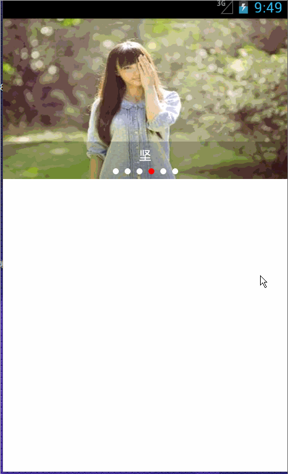

# PictureCarousel
一个非常简单的图片轮播，可自动轮播，按下和移动停止轮播，外加点击事件

***

## 使用方法：

1. 设置你需要展示的图片资源及图片描述文字

		/** 设置文字描述和图片数据 */
		public void setTitlesAndImages(String[] titles, List<ImageView> imgs) {
			this.titles = titles;
			this.mListDatas = imgs;
		}

2. 设置图片点击事件，点击图片进入需要展示的页面

		/** 设置监听 */
		public void setOnLunBoClickListener(OnLunBoClickListener onLunBoClickListener) {
			this.onLunBoClickListener = onLunBoClickListener;
		}

3. 控制图片开始轮播和停止轮播
	
		/** 开启自动轮播 */
		public void startAutoScroll() {
			if(!isScrolling){
				getAutoScrollTask().start();
				isScrolling = true;
			}
		}
	
		/** 停止自动轮播 */
		public void stopAutoScroll() {
			if(isScrolling){
				getAutoScrollTask().stop();
				isScrolling = false;
			}
		}

4. 使用例子：

		public class MainActivity extends Activity {
		
			int[] imgs = { R.drawable.img_0, R.drawable.img_1, R.drawable.img_2, R.drawable.img_3, R.drawable.img_4,
					R.drawable.img_5 };
			String[] titles = { "为", "梦", "想", "坚", "持", "呀" };
			private PicsView mPicsviewpager;
		
			@Override
			protected void onCreate(Bundle savedInstanceState) {
				super.onCreate(savedInstanceState);
				requestWindowFeature(Window.FEATURE_NO_TITLE);
				setContentView(R.layout.activity_main);
		
				mPicsviewpager = (PicsView) findViewById(R.id.picsviewpager);
		
				List<ImageView> imgList = new ArrayList<ImageView>();
				for(int i = 0; i < imgs.length; i++){
					ImageView iv = new ImageView(getApplicationContext());
					iv.setScaleType(ScaleType.FIT_XY);
					iv.setImageResource(imgs[i]);
					imgList.add(iv);
				}
				// 初始化数据
				mPicsviewpager.setTitlesAndImages(titles, imgList);
				
				// 设置点击事件
				mPicsviewpager.setOnLunBoClickListener(new OnLunBoClickListener() {
					
					@Override
					public void clickLunbo(int position) {
						System.out.println("点击有效");
						Toast.makeText(MainActivity.this, "点击有效，位置为：" + position, Toast.LENGTH_SHORT).show();
					}
				});
		
				// 设置文字的颜色，透明即不可见
				// picsviewpager.setLlBackgroundAlph(color.transparent);
				// 设置文字的背景，默认半透明，可以设置不可见
				// picsviewpager.setTvTitleVisibility(View.GONE);
			}
			
			@Override
			protected void onPause() {
				// 停止图片轮播
				mPicsviewpager.stopAutoScroll();
				super.onPause();
			}
			
			@Override
			protected void onResume() {
				// 开启图片轮播
				mPicsviewpager.startAutoScroll();
				super.onResume();
			}
		}

4. 演示：

